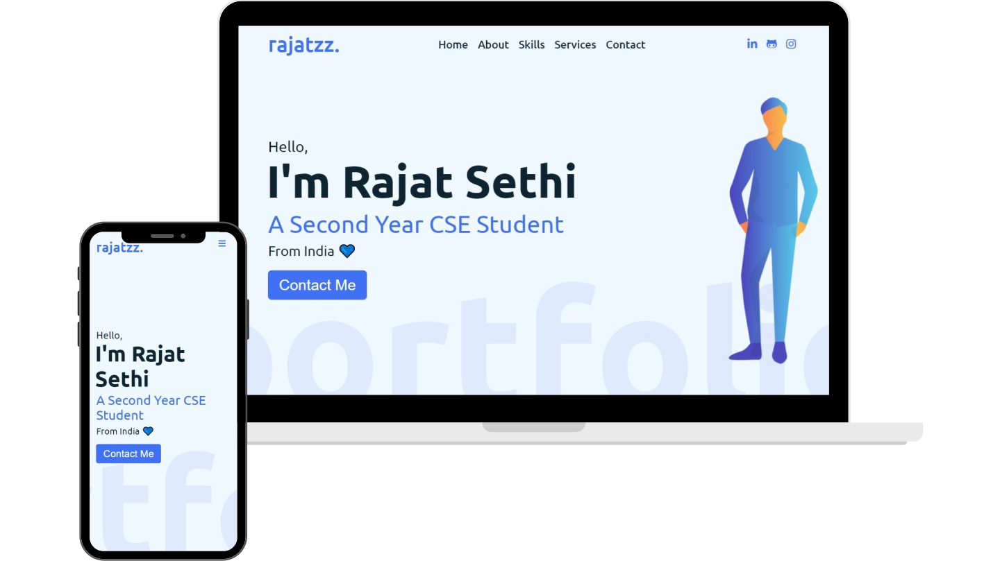

<h1 align="center">
  Portfolio Website - v1.0 
  <a href="http://rajatzz.github.io" target="_blank">rajatzz.github.io</a>
</h1>

 

  

 

  
 &nbsp;
 &nbsp;

# Introduction 🚶🏻‍♂️

🎯 Welcome to the project repository of my website! 

My personal portfolio website, <a href="http://rajatzz.github.io/" target="_blank">rajatz.github.io</a> showcasing me. 

Works are still being done actively in the background to make it better. Should you notice some minor discrepancies like minor bugs and issues, please feel free to create an Issue.

## 📁 Files Included 

* index.html
* style.css 
* script.js
* images folder

## 🚀 Features 

**📃 Single-Page Layout**

**📱 Fully Responsive**

## 📍 Resources 
 * <https://www.youtube.com/>
 * <https://www.w3schools.com/>
 * <https://css-tricks.com/>
 
>## Show your support

Give a ⭐ if you like this website!
 

 
<h2 align="center">Reach me on </h2>
  

